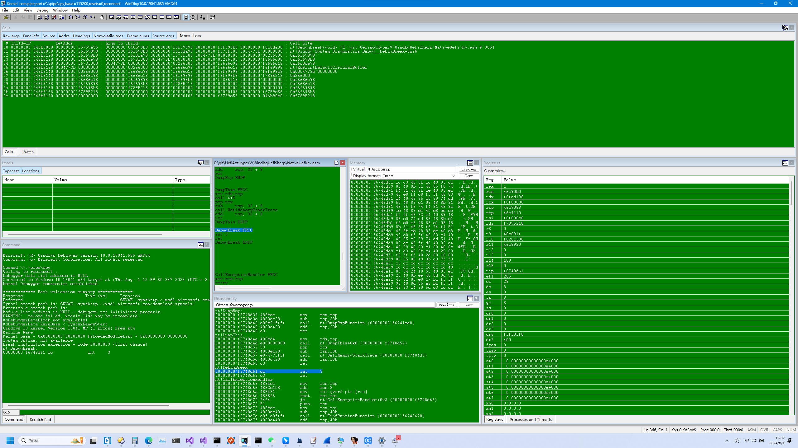
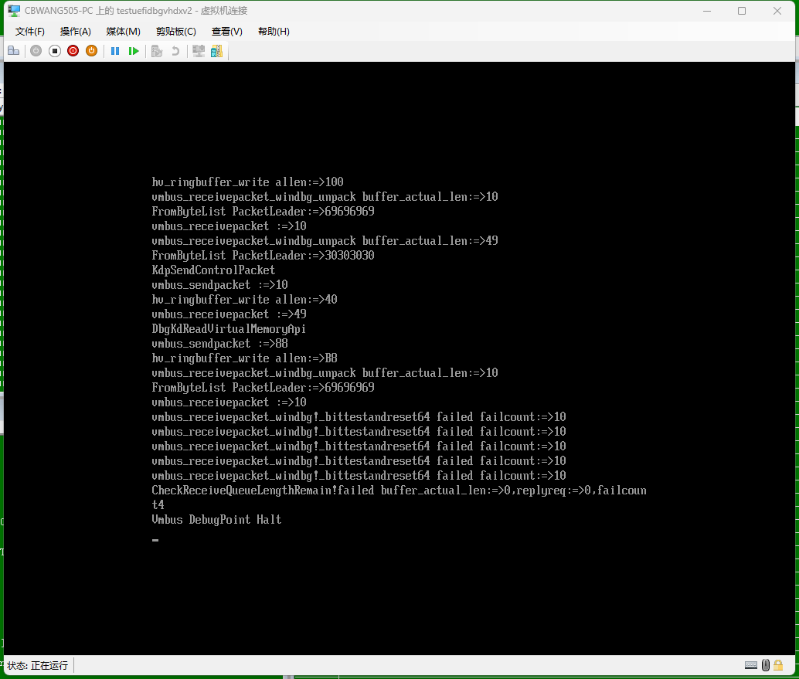

## 引用 ##

>这篇文章的目的是介绍一款实验性的Uefi项目基于.NET NativeAOT模式实现的运行在Windows Hyper-V虚拟机上的windbg调试引擎开发心得

[toc]

## 简介 ## 

笔者实现了一款采用.NET NativeAOT模式开发运行在Windows Hyper-V Uefi虚拟机上基于COM命名管道或者Vmbus通道的windbg调试协议引擎.
NativeAOT是.NET中一款将.NET程序集编译为原生二进制指令的编译模式,这种模式将.NET 带到了无需.NET Framework依赖即不允许JIT编译器的平台
比如uef或windos内核驱动或嵌入式设备或桌面程序等原生二进制指令目标平台.
笔者工具在原.NET NativeAOT项目的基础上拓展了动态接口的多态继承绑定实现,
还添加了执行IDT异常回调的模拟vcruntime实现的c++异常捕获特性,解决了在uefi程序运行过程中的不可预知的内部原生函数抛出异常处理的缓解措施.
笔者程序实现的windbg调试协议支持插件模式提供给后续的uefi应用程序调用插件绑定的接口于windbg调试引擎交互.
windbg调试器运行在hyper-v的宿主机上,通过代理程序中间人模式转发windbg内核命名管道调试数据适配到目的接口实现调试uefi程序,
记录或者实时捕捉调试数据到wireshark解析插件分析.

## NativeAOT模式动态接口的多态继承绑定实现方式分析 ## 

.NET NativeAOT程序的运行时动态接口的多态继承绑定结构信息有.NET编译器在编译时生成存储在PE结构中的InterfaceDispatchCell结构体中,在每次需要进行动态接口转换的过程中
调用RhpInitialDynamicInterfaceDispatch函数实现InterfaceDispatchCell结构体由r10寄存器传入,其中m_pStub指向RhpInitialDynamicInterfaceDispatch,m_pCache指向DispatchCellInfo结构体指针,
这个转换需要用到存入寄存器的值rcx寄存器指向的派生类this指针的第一个字段也就是MethodTable虚表用于确定派生类的基类绑定信息DynamicDispatchMapTable的相关属性.
而这个绑定信息结合最终需要转换的接口的DispatchCellInfo中指定的InterfaceType和InterfaceSlot,也就是目标接口类型和多态继承绑定的接口索引匹配派生类实现的接口信息.
如果找到的接口实现信息符合转换条件就会返回接口的MethodTable中实现的重载虚函数目标地址由rax返回,控制流跳转到rax实现动态接口的实现分发.
```
  internal unsafe struct DispatchCellInfo
  {
      public DispatchCellType CellType;
      public MethodTable* InterfaceType;
      public ushort InterfaceSlot;
      public byte HasCache;
      public uint MetadataToken;
      public uint VTableOffset;
  };
  internal unsafe struct InterfaceDispatchCell
  {
      public IntPtr m_pStub;
      public IntPtr **m_pCache**;
  };
  private unsafe static bool FindImplSlotInSimpleMap(MethodTable* pTgtType,
                             MethodTable* pItfType,
                             uint itfSlotNumber,
                             ushort* pImplSlotNumber,
                             MethodTable** ppGenericContext,
                             bool actuallyCheckVariance,
                             bool checkDefaultImplementations)
  {
if (pTgtType->HasDispatchMap)
{
 DispatchMap.DispatchMapEntry* i = fStaticDispatch ?
     pMap->GetStaticEntry(checkDefaultImplementations ? (int)pMap->NumStandardStaticEntries : 0) :
     pMap->GetEntry(checkDefaultImplementations ? (int)pMap->NumStandardEntries : 0);
 DispatchMap.DispatchMapEntry* iEnd = fStaticDispatch ?
     pMap->GetStaticEntry(checkDefaultImplementations ? (int)(pMap->NumStandardStaticEntries + pMap->NumDefaultStaticEntries) : (int)pMap->NumStandardStaticEntries) :
     pMap->GetEntry(checkDefaultImplementations ? (int)(pMap->NumStandardEntries + pMap->NumDefaultEntries) : (int)pMap->NumStandardEntries);
  for (; i != iEnd; i = fStaticDispatch ? (DispatchMap.DispatchMapEntry*)(((DispatchMap.StaticDispatchMapEntry*)i) + 1) : i + 1)
     if (i->_usInterfaceMethodSlot == itfSlotNumber)
      {
          MethodTable* pCurEntryType = pTgtType->InterfaceMap[i->_usInterfaceIndex].InterfaceEntryType;      
          if (pCurEntryType == pItfType)          
              return true;
      }     
 public unsafe static IntPtr FindInterfaceMethodImplementationTarget(MethodTable* pTgtType, MethodTable* pItfType, ushort itfSlotNumber, MethodTable** ppGenericContext)
 {
  if (FindImplSlotForCurrentType(
         pCur, pItfType, itfSlotNumber, fDoDefaultImplementationLookup, &implSlotNumber, ppGenericContext))
 {
                    if (implSlotNumber < pCur->NumVtableSlots)
                    {
                        //之后调用基类实现jmp rax
                        return pTgtType->GetVTableStartAddress()[(int)implSlotNumber];
                    }
}
RhpInitialDynamicInterfaceDispatch PROC
sub     rsp, 78h
mov     [rsp+80h], rcx
mov     [rsp+88h], rdx
mov     [rsp+90h], r8
mov     [rsp+98h], r9
movdqa  xmmword ptr [rsp+20h], xmm0
movdqa  xmmword ptr [rsp+30h], xmm1
movdqa  xmmword ptr [rsp+40h], xmm2
movdqa  xmmword ptr [rsp+50h], xmm3
mov     rdx, r10
mov     rcx, qword ptr [rsp+80h]
call    RhpCidResolve
movdqa  xmm0, xmmword ptr [rsp+20h]
movdqa  xmm1, xmmword ptr [rsp+30h]
movdqa  xmm2, xmmword ptr [rsp+40h]
movdqa  xmm3, xmmword ptr [rsp+50h]
mov     rcx, [rsp+80h]
mov     rdx, [rsp+88h]
mov     r8, [rsp+90h]
mov     r9, [rsp+98h]
nop
add     rsp, 78h
test rax,rax
je cleanup
jmp     rax
cleanup:
ret
RhpInitialDynamicInterfaceDispatch ENDP
```
.NET NativeAOT程序中windows桌面程序的动态接口分发实现由.NET编译器内嵌的运行时静态库库的TypeManager类实现,笔者的uefi项目并没有依赖于编译器提供的编译扩展运行时支持,
通过手动方式实现,TypeManager类实现实际上是由一个包含于模块基址和一个指向pe结构中一个名为ReadyToRunSectionType.InterfaceDispatchTable节的分发结构体表组成.
只需要构造这样一个结构体放入ReadyToRunSectionType.TypeManagerIndirection节的首地址就可以完成,每个类虚表的默认的TypeManagerHandle.TypeManager字段就指向这个节的地址.
有了这样一个结构体就可以在它的DispatchMap字段找到需要分发的目标类型DispatchMap分发信息.至此.NET的运行时动态接口的多态继承特性已经可以完美实现运行在uefi程序上.
笔者使用这个特性实现了c#的IEnumerable接口为工程提供了一套类似linq的集合类型扩展方法实现.
笔者项目关闭了项目选项EnableDefaultCompileItems选项,重写了.net基类的运行时实现,只适配于编译器版本Microsoft.DotNet.ILCompiler Version=7.0.19版本

## NativeAOT模式运行时栈回溯实现方式分析 ## 

.NET NativeAOT程序运行时函数符号信息存储于pe节的ReadyToRunSectionType.BlobIdStackTraceMethodRvaToTokenMapping节中,需要在项目配置文件开启StackTraceSupport选项.
相对于c编写的二进制程序,默认函数的符号信息存在于pdb文件中,二进制主程序不包含函数的符号信息,在没有pdb文件的情况下获取函数名等符号信息是不可行的.对于NativeAOT程序只要开启了开启StackTraceSupport选项,
尽管会增加最后生成的二进制文件大小,但是对于异常的处理工作可以就可以实现在不需要pdb文件的情况下实现栈回溯的辅助功能.BlobIdStackTraceMethodRvaToTokenMapping节中节保存了所有运行时函数的rva信息,
每个rva关联一个token组成一个字典结构,通过这个token可以在ReadyToRunSectionType.ReflectionMapBlobEmbeddedMetadata找到已明文存储的函数名的字符串数据,具体偏移量解码方式只需要调用微软官方的NativePrimitiveDecoder函数即可.
在抛出异常是可以在idt中获取当前抛出异常原的栈rsp和函数地址rip,首先展示rip的函数信息,再从rsp向上遍历直到找到一个在缓存字典中符号的函数信息,就可以完整展示当前抛出异常时的栈回溯信息.
```
List<FunctionTraceMap> FunctionTokenMap = new List<FunctionTraceMap>();
IntPtr pMap =StartupCodeHelpers.GetModuleSectionWithLength(moduleSeg, ReadyToRunSectionType.BlobIdStackTraceMethodRvaToTokenMapping, ref length);
int* rvaToTokenMap = (int*)pMap;
int rvaToTokenMapEntryCount = (int)((int)length / (2 * sizeof(int)));
for (int entryIndex = 0; entryIndex < rvaToTokenMapEntryCount; entryIndex++)
{
    int* pRelPtr32 = &rvaToTokenMap[2 * entryIndex + 0];    
    IntPtr pointer = (IntPtr)((IntPtr)pRelPtr32 + *pRelPtr32);
    int methodRva = (int)(pointer - UefiApplication.ImageBase);
    int token = rvaToTokenMap[2 * entryIndex + 1];
      if (!methodRvaToTokenMap.ContainsKey(methodRva))
    {
        methodRvaToTokenMap.Add(methodRva, token);
    }
}
IntPtr length = 0;
IntPtr pEmbeddedMetadata = StartupCodeHelpers.GetModuleSectionWithLength(moduleSeg, ReadyToRunSectionType.ReflectionMapBlobEmbeddedMetadata, ref length);
byte* pCurrent = (byte*)pEmbeddedMetadata;
byte* pCurrentsave = (byte*)pEmbeddedMetadata;
foreach (KeyValuePair<int, int> kv in methodRvaToTokenMap)
{            
      IntPtr methodRva =new IntPtr(kv.Key);
      IntPtr metthodPtr = methodRva + UefiApplication.ImageBase;   
      int token = kv.Value & 0xffffff;
      pCurrent = (byte*)pEmbeddedMetadata;
      pCurrent += token;              
      UInt32 memberReference_parent = NativePrimitiveDecoder.DecodeUnsigned(ref pCurrent);          
      UInt32 memberReference_name = NativePrimitiveDecoder.DecodeUnsigned(ref pCurrent);            
      IntPtr pCurrentstringsave = pEmbeddedMetadata + memberReference_name + 1;
      //这个就是函数名
      string methodname = string.FromASCII(pCurrentstringsave).Trim();
      FunctionTraceMap traceMap = new FunctionTraceMap(metthodPtr, methodname);
      FunctionTokenMap.Add(traceMap);
}
//获取某个函数的符号信息
private static bool DumpFunctionAddressAndName(IntPtr FunPtr)
{
int len = FunctionTokenMap.Count;
for (int j = 0; j < len; j++)
 {
     int k = j + 1;
     FunctionTraceMap tmpj = FunctionTokenMap[j];
     IntPtr FunPtrj = tmpj.FunctionAddress - modbase;
     IntPtr FunDiff = FunPtr - tmpj.FunctionAddress;    
     FunctionTraceMap tmpk = FunctionTokenMap[k];
     if (tmpk.FunctionAddress > FunPtr && FunPtr > tmpj.FunctionAddress - difflen)
     {   
           Console.WriteLine(FunPtr.ToString("x") + ":=>" +":base+" + FunPtrj.ToString("x") + "=" +  tmpj.FunctionName + "+" + FunDiff.ToString("x"));     
     }
}
```
笔者为字符串匹配提供了一个string.FromASCII函数,过滤了其中无效ASCII字符,只保留可打印的函数名字符串,具体源码可以在笔者开源项目中找到.
这个栈回溯信息结合了下面节介绍的异常捕获处理为程序的调试工作提供了很好的辅助功能.

## 模拟vcruntime实现的c++异常捕获特性分析 ## 

C和C++程序都可以在x86平台指令集使用结构化异常处理（SEH）机制.
C的异常处理SEH中的概念类似于C++异常中的概念，除了SEH使用__try、__except和__finally构造而不是C++异常中的try和catch.
在在微软C++编译器（MSVC）中，为SEH实现了C++异常。但是写C++代码时,需要使用C++异常语法,SEH同样可以捕获C++异常,需要在vs从开启配置(配置属性->c/c++->启用c++异常->是但有seh异常(/EHA)).
下面这段代码展示一个一段简单C++异常语法.
```
EXTERN_C EFI_STATUS OutputStringWrapper(IN CHAR16* buf)
{
	try {
		ConsoleOutputString(buf);
	}
	catch (...)
	{
		Print(L"Exception OutputString Handler\r\n");
	}
	return 0;
}
```
对于上面这段函数默认会编译出OutputStringWrapper和OutputStringWrapper$catch$0两个内部的函数形式,前者用于在函数入口处理,后者用于在捕获异常时由栈迭代找到栈上的异常捕获函数跳转到这个异常捕获函数执行.
运行时异常信息存在pe结构的EFI_IMAGE_DIRECTORY_ENTRY_EXCEPTION表OptionalHeader中,这个表中保存的是一个IMAGE_RUNTIME_FUNCTION_ENTRY数组具体结构如下,
windbg提供一个功能用于异常结构的展示,运行效果如下
```
kd> .fnent nt!OutputStringWrapper
Debugger function entry 00000145`3c7ce180 for:
 [E:\git\UefiAotHyperV\WindbgUefiSharp\NativeUefi\nativelib.cpp @ 63] (00000000`f6744ac0)   nt!OutputStringWrapper   |  (00000000`f6744ae0)   nt!WriteLineWrapper
Exact matches:
    nt!OutputStringWrapper (unsigned short *)

BeginAddress      = 00000000`00005ac0
EndAddress        = 00000000`00005add
UnwindInfoAddress = 00000000`0002ebc8

Unwind info at 00000000`f676dbc8, 10 bytes
  version 1, flags 3, prolog 9, codes 1
  handler routine: nt!__CxxFrameHandler4 (00000000`f6743360), data 2ebd8
  00: offs 9, unwind op 2, op info 4	UWOP_ALLOC_SMALL.
```
这个结构包含了所有运行时函数的起始地址和结束地址,紧跟在其后的是一个指向UnwindData的PUNWIND_CODE指针偏移量,这个结构保存了当异常栈帧需要展开的时候需要在栈上开辟的空间和用于在栈上保存非易失寄存器值的
prolog(序言)和epilog(末言)由异常处理程序处理的结构化信息.prolog例程执行完成后执行PUNWIND_CODE尾部保存的真正的异常处理回调.
一些典型的UNWIND_CODE包括：
ALLOC_SMALL/LARGE（为局部参数分配小/大内存，例如sub rsp, 80h）
PUSH_NONVOL（将非易失性寄存器推送到堆栈，例如push rdi）
在开启的包含异常代码的x86平台程序时编译器默认会将异常处理回调绑定到一个__CxxFrameHandler4函数,
这个函数默认在vcruntime.dll实现借助了ntdll的RtlVirtualUnwind系统自带异常栈帧展开功能找到异常函数对于的捕获函数,并跳转到捕获函数执行.这个过程实际上是对于PUNWIND_CODE尾部保存回调后面的ExceptionData数据的展开,
可以在开源的vcruntime运行库源码中找到实现,展开数据后最终得到的一个TryBlockMap4._handler.dispOfHandler就是异常捕获处理的函数地址.笔者是uefi程序没有vc运行时,采用手动方式实现,具体方法如下.
```
typedef struct _IMAGE_RUNTIME_FUNCTION_ENTRY {
	DWORD BeginAddress;
	DWORD EndAddress;
	union {
		DWORD UnwindInfoAddress;
		DWORD UnwindData;
	} u;
} _IMAGE_RUNTIME_FUNCTION_ENTRY, * _PIMAGE_RUNTIME_FUNCTION_ENTRY;
typedef union _UNWIND_CODE {
    struct {
        UBYTE CodeOffset;
        UBYTE UnwindOp : 4;
        UBYTE OpInfo   : 4;
    };
    USHORT FrameOffset;
} UNWIND_CODE, *PUNWIND_CODE;
typedef struct _UNWIND_INFO {
    UBYTE Version       : 3;
    UBYTE Flags         : 5;
    UBYTE SizeOfProlog;
    UBYTE CountOfCodes;
    UBYTE FrameRegister : 4;
    UBYTE FrameOffset   : 4;
    UNWIND_CODE UnwindCode[1];
/*  UNWIND_CODE MoreUnwindCode[((CountOfCodes + 1) & ~1) - 1];
    OPTIONAL ULONG ExceptionHandler;
*   OPTIONAL ULONG ExceptionData[]; */
} UNWIND_INFO, *PUNWIND_INFO;
EXTERN_C  UINT64 EFIAPI FindRuntimeFunction(UINT64 modbase,UINT64 fakefun)
{	
	FuncInfo4 FuncInfoDe;		
	UINT32 fakefunstart = (UINT64)fakefun - modbase;	;
	for (PRUNTIME_FUNCTION RuntimeFunctionEntry = pImageRuntimeFunctionDirectory; RuntimeFunctionEntry < pImageRuntimeFunctionDirectoryEnd; RuntimeFunctionEntry++)
	{
		if (RuntimeFunctionEntry->BeginAddress + modbase <= fakefun && RuntimeFunctionEntry->EndAddress + modbase > fakefun)
		{			
			PUNWIND_INFO UnwindDatainfo = (PUNWIND_INFO)(modbase + RuntimeFunctionEntry->u.UnwindInfoAddress);
			PUNWIND_CODE UnwindCode = (PUNWIND_CODE)((UINT64)UnwindDatainfo + sizeof(UNWIND_INFO));
			int len = ((UnwindDatainfo->CountOfCodes + 1) & ~1) + 2;
			UINT32 ExceptionData = *(UINT32*)(UnwindCode + len);		
			uint8_t* buffer = (uint8_t*)modbase + ExceptionData;
			DecompFuncInfo(buffer, FuncInfoDe, modbase, RuntimeFunctionEntry->BeginAddress);		
			TryBlockMap4 trymap(&FuncInfoDe, modbase);	
			HandlerMap4 handlermap(&trymap._tryBlock, modbase, RuntimeFunctionEntry->BeginAddress);	
			UINT64 realHandler = handlermap._handler.dispOfHandler + modbase;			
	     	实际上就是返回OutputStringWrapper$catch$地址
			return (UINT64)realHandler;
		}
	}
	return 0;
}
```
在抛出异常是可以在idt中获取当前抛出异常原的栈rsp和函数地址rip,对x86windows应用程序由内核idt分发到teb结构的异常处理分发函数执行,根据以上代码在异常rip找到异常捕获回调,根据rsp向上迭代直到找到一个符号条件运行时函数PIMAGE_RUNTIME_FUNCTION作为当前异常捕获回调的返回地址,
当前迭代的这个rsp也同样作为异常捕获回调分配的rsp地址,对这个rsp完成prolog例程执行后,执行后异常捕获回调会自动从栈中弹出异常捕获函数所在主函数的上层调用地址,返回到这个地址继续执行程序.
至此就完成了实现在uefi平台上模拟vcruntime实现的c++异常捕获特性功能.这种方式并不和调试器模式冲突,可以在idt中判断异常的int3向量触发的话中断到调试器,如果异常处理函数未找到或者处理失败情况下中断到调试器,
否则调用异常捕获回调函数恢复继续执行.

## Windows Hyper-V虚拟机Vmbus通道分析 ## 

笔者用.net代码重构了用c代码实现的vmbus通道接口功能,hyper-v包含很多内置的uefi模块,同样需要使用simp和siep通信页面,所以在运行笔者uefi程序时获取这些msr寄存器是有值的,
使用原来的共享页面有个问题就是当退出笔者uefi程序的时候由于旧sint被笔者使用了导致内置的uefi模块的控制台功能也需要借助通道页面通信,存在冲突问题导致控制台卡住.
但是笔者后来发现了一种方法可以解决这个问题正常退出的uefi控制台,具体实现方式是如果旧uefi模块通道的sint为2,笔者使用一个新的sint比如说5,为这个sint分配一个新的idt回调向量同样可以收到vsp发来的触发通道消息,
在CHANNELMSG_INITIATE_CONTACT协商消息中使用绑定这个sint,这样可以在回复消息中vmbus_channel_version_response->messageConnectionId得到一个新的连接id,
这样就可以用在后续的调用HvCallPostMessage使用使用这个新的连接id,后续通信的gpadl页面使用新申请的页面,实现了不和内置的uefi模块同时共享通道冲突解决方法.
笔者uefi程序退出后控制台可以正常使用,对后续其他uefi程序没有影响.

Vmbus通道分析见作者上篇文章[windbg原生调试协议在hyper-v平台uefi上多种实现方式探索](https://bbs.kanxue.com/thread-281707.htm)


## 编译运行方式 ## 

选择一种通用模式编译工程,使用vs2022编译,不需要依赖edk2静态库文件,笔者项目只支持hyper-v不支持vmware和qemu

DiskGenius新建虚拟硬盘文件.img 自定义256mb 快速分区guid模式

自定义1个分区建立esp分区建立msr分区esp大小200mb

esp分区添加

制作iso文件shell.efi放到esp分区这个位置重命名

\EFI\BOOT\bootx64.efi

创建如下文件

\EFI\BOOT\startup.nsh

内容如下,放入编译出来的windbg.efi

load fs0:windbg.efi

可以使用[作者iso制作工具](https://github.com/cbwang505/UefiBootISOMaker/tree/main)制作iso

ISOTOOL.exe "pathto\EspPartitionDir" "pathto\IsoFilePath.iso"


或者使用如下powershell命令制作hyper-v的vhdx磁盘文件

```
$psdir = Split-Path $MyInvocation.MyCommand.Path -Parent
$vhdxpath = Join-Path $psdir "hv.vhdx"
$uefishell = Join-Path $psdir "bootx64.efi"
$uefistartup = Join-Path $psdir "startup.nsh"
$uefiapp = Join-Path $psdir "windbg.efi"
$uefidir= "N:\EFI\BOOT\"
Write-Host $vhdxpath
$disk = New-VHD -Path $vhdxpath -Dynamic -SizeBytes 10GB  | Mount-VHD -PassThru | Get-Disk
Initialize-Disk -Number $disk.Number -PartitionStyle GPT
New-Partition -DiskNumber $disk.Number -Size 500MB -GptType "{c12a7328-f81f-11d2-ba4b-00a0c93ec93b}" -DriveLetter "N"
Format-Volume -DriveLetter  "N" -FileSystem FAT32 -Force -Confirm:$false
New-Item -ItemType "directory" -Path $uefidir
Copy-Item $uefishell  -Destination $uefidir
Copy-Item $uefistartup  -Destination $uefidir
Copy-Item $uefiapp   -Destination "N:\"
Dismount-VHD -Path  $vhdxpath
```

更新vhdx文件中的主程序windbg.efi可以参考笔者脚本

```
"C:\Windows\System32\WindowsPowerShell\v1.0\powershell.exe" -exec bypass -Command "Stop-VM -Name hv -TurnOff -Force"
"C:\Program Files (x86)\Windows Kits\10\Debuggers\x64\symstore.exe" add /r /f "E:\git\UefiAotHyperV\WindbgUefiSharp\Windbg\bin\Release\net7.0\win-x64\publish" /s "%SYMBOL_STORE%" /t niii
"C:\Windows\System32\WindowsPowerShell\v1.0\powershell.exe" -exec bypass -Command " Mount-VHD -Path 'F:\hyperv\hv\Virtual Hard Disks\hv.vhdx'"
copy "E:\git\UefiAotHyperV\WindbgUefiSharp\Windbg\bin\Release\net7.0\win-x64\native\Windbg.exe" "K:\Windbg.efi"  /Y
"C:\Windows\System32\WindowsPowerShell\v1.0\powershell.exe" -exec bypass -Command "Dismount-VHD 'F:\hyperv\hv\Virtual Hard Disks\hv.vhdx'"
```

虚拟机选项第二代虚拟机,关闭安全引导,挂载iso或者vhdx设为首选启动项

编译pipe工程,注意必须编译为x64模式:

运行windbg调试协议wireshark抓包解析插件pipe.exe

pathto\bin\x64\Debug\pipe.exe spy windbg bacnet auto vmname

启动"C:\Program Files\Wireshark\Wireshark.exe"  -ni \\.\pipe\bacnet

选择\\.\pipe\bacnet进入实时捕捉模式

等待windbg调试器中断

历史记录数据在pipe.exe目录下可以找到pcap文件


## 运行效果 ##

以下是笔者工具运行的效果,如图:




##  相关引用 ##

[原作者工具wireshark抓包解析插件](https://github.com/Lekensteyn/kdnet/tree/master)

[作者工具](https://github.com/cbwang505/windbg-wireshark)

[VisualUefi](https://github.com/ionescu007/VisualUefi)

[edk2](https://github.com/tianocore/edk2/tree/master)

[Windows Hypervisor Platform API](https://learn.microsoft.com/en-us/virtualization/api/)

[VirtualKD-Redux-windbg实现](https://github.com/4d61726b/VirtualKD-Redux/blob/a59549d4597bfe514cb92cc195791ce0d3cc6886/VirtualKD-Redux/Lib/rpcdispatch/kdcomdisp.cpp)

[reactos-windbg实现](https://github.com/mirror/reactos/blob/c6d2b35ffc91e09f50dfb214ea58237509329d6b/reactos/drivers/base/kdcom/kddll.c)

[VmBusDriver](https://github.com/toddsharpe/MetalOS/blob/master/src/kernel/Drivers/VmBusDriver.cpp)

[pxe-vmbus](https://github.com/ipxe/ipxe/blob/59f27d69358efc919b50760f3d6dac0b637b5488/src/interface/hyperv/vmbus.c)

[linux-vmbus](https://github.com/LIS/lis-next/blob/5f06e3f9530cc7c0dcece6f6d0fb1b0987ac17df/hv-rhel7.x/hv/channel_mgmt.c)

[mac-vmbus](https://github.com/acidanthera/MacHyperVSupport/blob/e987ee22940b483df5a8b4d419d13350e494d95b/MacHyperVSupport/VMBus/HyperVVMBus.cpp)

[VmBusPipe](https://github.com/awakecoding/VMBusPipe/blob/master/VmBusPipeTest/Main.c)

[Hyper-V socket](https://learn.microsoft.com/en-us/virtualization/hyper-v-on-windows/user-guide/make-integration-service)

[edk2-hv-net项目](https://github.com/cbwang505/windbg-uefi/tree/main/ext)

[原.NET NativeAOT项目](https://github.com/xccoreco/Moos-Future)

[vcruntime开源版](https://github.com/Chuyu-Team/VC-LTL/tree/master)

[vcruntime实现的c++异常捕获](https://learn.microsoft.com/en-us/cpp/build/exception-handling-x64?view=msvc-170)

[UNWIND_INFO分析](https://codemachine.com/articles/x64_deep_dive.html)

[作者iso制作工具](https://github.com/cbwang505/UefiBootISOMaker/tree/main)

[作者工具c项目](https://github.com/cbwang505/windbg-uefi)

[作者工具主项目](https://github.com/cbwang505/windbgonuefi.netaot.git)

## 参与贡献 ##


作者来自ZheJiang Guoli Security Technology,邮箱cbwang505@hotmail.com
